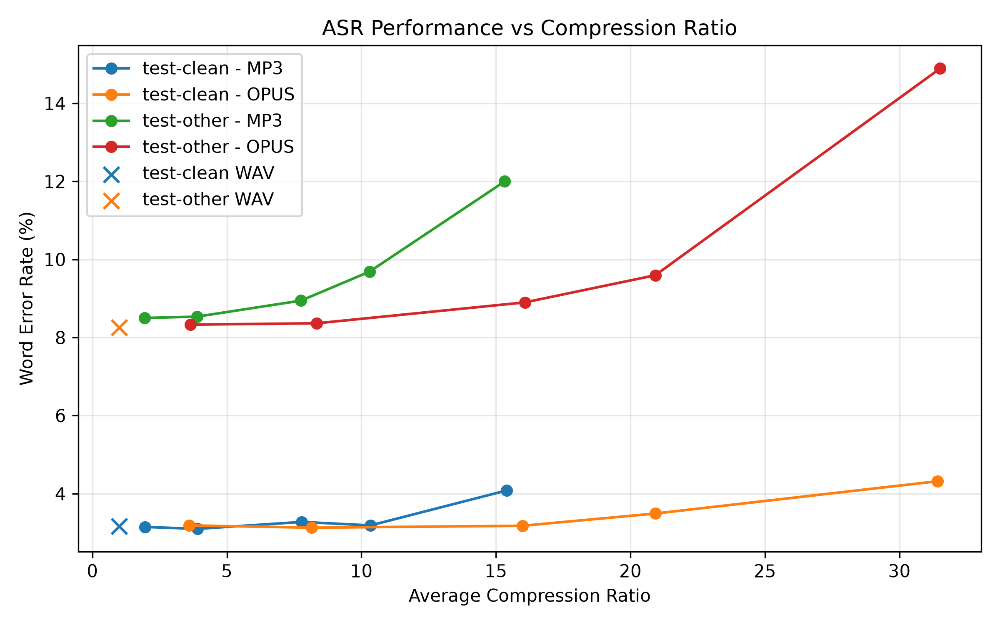
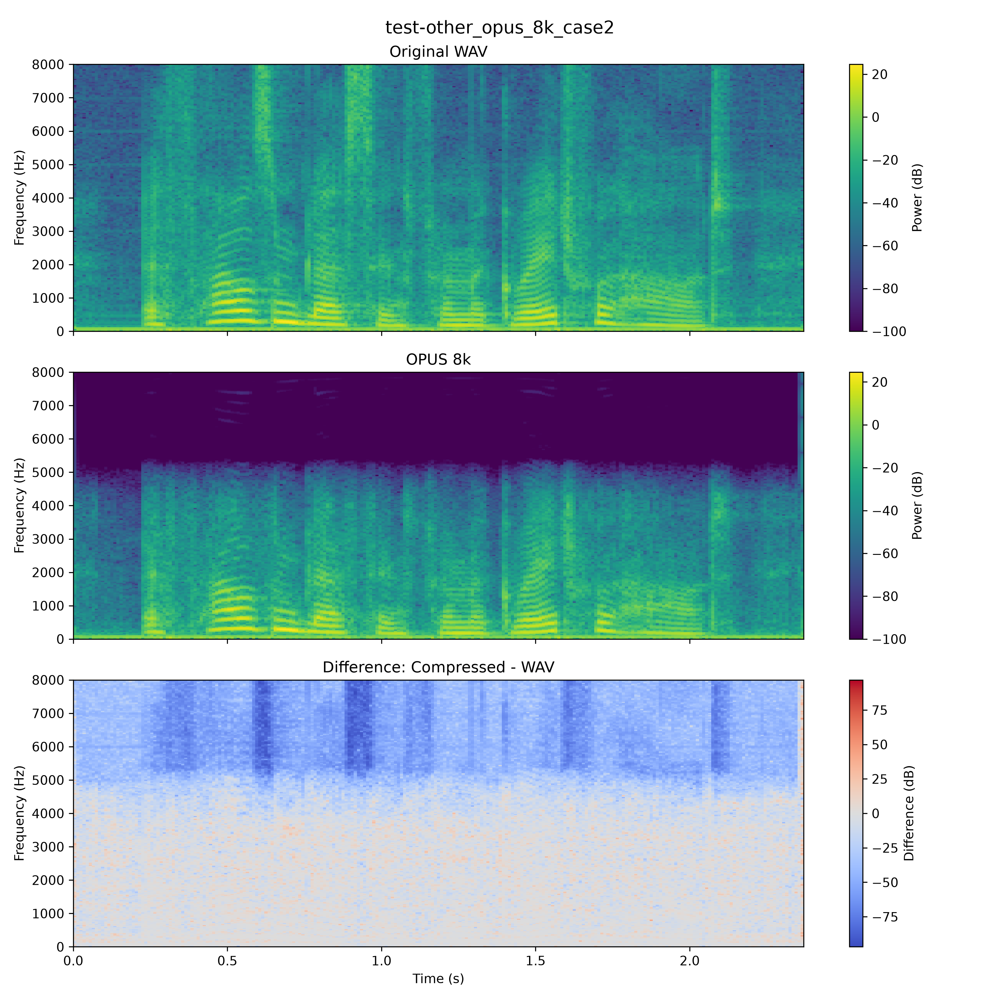

  <h1>Evaluating the Impact of Lossy Audio Compression on Automatic Speech Recognition Performance</h1>
  

    ELEC5305 project investigating how MP3 and Opus compression affect a fixed
    Wav2Vec2 automatic speech recognition system across clean and more challenging speech.
  

  

    Wav2Vec2
    LibriSpeech
    MP3 + Opus
    500 samples / subset
    Bootstrap CI
    Spectrogram analysis
  

## Research Question

<strong>How robust is a modern automatic speech recognition system to lossy audio compression, and at what bitrate or compression ratio does recognition performance begin to degrade significantly?</strong>
  
Secondary question: <em>Does compression have a greater impact when the underlying speech is already more difficult for the ASR system to recognise?</em>

  

    
3.17%

    
test-clean WAV baseline WER

  

  

    
8.26%

    
test-other WAV baseline WER

  

  

    
31.5×

    
Approx. compression ratio at Opus 8 kbps

  

## Experimental Design

Two LibriSpeech evaluation subsets are used:

- `test-clean`
- `test-other`

For each subset, **500 utterances** are selected using a fixed random seed (`5305`) for reproducibility.

The same pretrained **Wav2Vec2** ASR model is used for every condition. Audio is compressed with **FFmpeg**, decoded, and then evaluated using **Word Error Rate (WER)**. Compression efficiency is measured using the average ratio between original WAV file size and compressed file size.

### Compression Conditions

| Codec | Bitrates |
|---|---|
| WAV | Uncompressed baseline |
| MP3 | 128, 64, 32, 24, 16 kbps |
| Opus | 64, 32, 16, 12, 8 kbps |

## Current Results

### test-clean

| Condition | WER | ΔWER | Compression Ratio |
|---|---:|---:|---:|
| WAV | 3.17% | 0.00 pp | 1.00× |
| MP3 128k | 3.15% | -0.02 pp | 1.95× |
| MP3 64k | 3.10% | -0.07 pp | 3.90× |
| MP3 32k | 3.27% | +0.11 pp | 7.78× |
| MP3 24k | 3.19% | +0.02 pp | 10.34× |
| **MP3 16k** | **4.08%** | **+0.91 pp** | **15.40×** |
| Opus 64k | 3.19% | +0.02 pp | 3.59× |
| Opus 32k | 3.13% | -0.04 pp | 8.15× |
| Opus 16k | 3.18% | +0.01 pp | 15.98× |
| **Opus 12k** | **3.49%** | **+0.32 pp** | **20.93×** |
| **Opus 8k** | **4.32%** | **+1.15 pp** | **31.41×** |

### test-other

| Condition | WER | ΔWER | Compression Ratio |
|---|---:|---:|---:|
| WAV | 8.26% | 0.00 pp | 1.00× |
| MP3 128k | 8.50% | +0.24 pp | 1.95× |
| MP3 64k | 8.54% | +0.27 pp | 3.89× |
| MP3 32k | 8.95% | +0.68 pp | 7.75× |
| **MP3 24k** | **9.69%** | **+1.42 pp** | **10.30×** |
| **MP3 16k** | **12.00%** | **+3.74 pp** | **15.33×** |
| Opus 64k | 8.33% | +0.07 pp | 3.64× |
| Opus 32k | 8.36% | +0.10 pp | 8.34× |
| Opus 16k | 8.90% | +0.64 pp | 16.08× |
| **Opus 12k** | **9.60%** | **+1.33 pp** | **20.92×** |
| **Opus 8k** | **14.89%** | **+6.63 pp** | **31.52×** |

## Key Findings

  

    <strong>1. Moderate compression is relatively robust</strong>
    On <code>test-clean</code>, most moderate MP3 and Opus conditions remain close to the WAV baseline.
  

  

    <strong>2. Severe compression creates clear degradation</strong>
    Low-bitrate MP3 and Opus conditions produce consistent increases in WER.
  

  

    <strong>3. Harder speech is more vulnerable</strong>
    <code>test-other</code> shows substantially larger WER increases under the same aggressive compression conditions.
  

  

    <strong>4. Substitutions dominate the extra errors</strong>
    The majority of additional recognition errors under severe compression are word substitutions rather than deletions or insertions.
  

## Bootstrap Analysis

A paired bootstrap analysis with **2000 resamples** estimates 95% confidence intervals for the WER change relative to the WAV baseline.

| Dataset | Condition | ΔWER | 95% CI |
|---|---|---:|---:|
| test-clean | MP3 16k | +0.91 pp | [+0.59, +1.29] |
| test-clean | Opus 12k | +0.32 pp | [+0.09, +0.57] |
| test-clean | Opus 8k | +1.15 pp | [+0.81, +1.51] |
| test-other | MP3 16k | +3.74 pp | [+3.07, +4.43] |
| test-other | Opus 8k | +6.63 pp | [+5.71, +7.62] |

The strongest degradation observed so far is <strong>Opus 8 kbps on test-other</strong>, where WER rises from approximately <strong>8.26%</strong> to <strong>14.89%</strong>.

## Error-Type Analysis

| Condition | Δ Substitutions | Δ Deletions | Δ Insertions |
|---|---:|---:|---:|
| test-clean MP3 16k | +85 | +15 | -7 |
| test-clean Opus 8k | +104 | +14 | -1 |
| test-other MP3 16k | +280 | +42 | +6 |
| test-other Opus 8k | +490 | +62 | +30 |

For the most severe conditions, substitutions account for the majority of the additional word-level errors. This suggests that aggressive compression most often causes the ASR model to confuse one word with another rather than simply inserting or deleting words.

## Signal-Level Case Studies

Sentence-level and local spectrogram comparisons have been produced for selected utterances where the WAV baseline was recognised correctly but the compressed version introduced a new recognition error.

The low-bitrate MP3 and Opus examples show substantial attenuation and modification of high-frequency spectral content. These observations are consistent with the recognition degradation measured above, although the spectrogram differences are treated as supporting evidence rather than proof of direct causation.

### Representative cases

- `test-other` + MP3 16 kbps
- `test-other` + Opus 8 kbps
- `test-clean` + MP3 16 kbps

<!--
When selected figures are committed to the repository, uncomment and update
the paths below.

  

  

-->

## Current Interpretation

The project currently supports three main conclusions:

1. **Moderate lossy compression has little practical effect on ASR performance for clean speech.**
2. **Severe low-bitrate compression produces measurable and statistically consistent degradation.**
3. **More challenging speech is substantially more vulnerable to compression-induced distortion.**

Opus appears able to maintain strong ASR performance at relatively high compression ratios, but very aggressive settings such as 8 kbps lead to substantial degradation.

## Next Steps

- refine final plots and statistical visualisation
- select the strongest case-study figures
- compare MP3 and Opus robustness more systematically
- document experimental limitations
- prepare the final report and project demonstration

## Repository

**GitHub repository:**  
https://github.com/surnamemei/elec5305-project-540077463

ELEC5305 project — current results are preliminary and may be refined as the project progresses.

