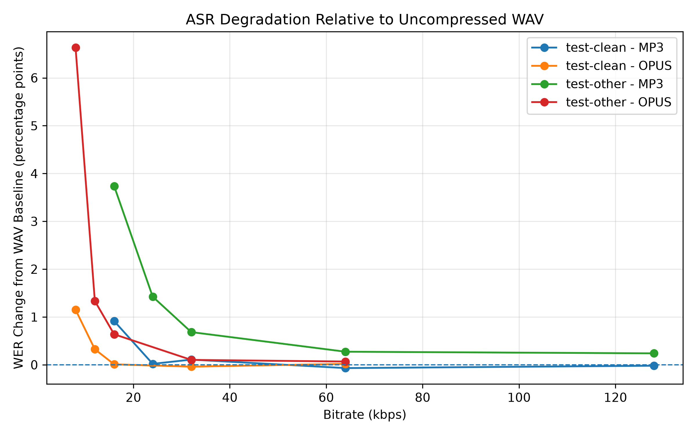

  

    <h1>Evaluating the Impact of Lossy Audio Compression on Automatic Speech Recognition Performance</h1>
    

      ELEC5305 project investigating how MP3 and Opus compression affect a fixed
      Wav2Vec2 automatic speech recognition system across clean and more challenging speech.
    

    

      Wav2Vec2
      LibriSpeech
      MP3 + Opus
      500 samples / subset
      Bootstrap CI
      Spectrogram analysis
    

  

  <section class="section">
    <h2>Research Question</h2>
    

      <strong>How robust is a modern automatic speech recognition system to lossy audio compression, and at what bitrate or compression ratio does recognition performance begin to degrade significantly?</strong>
        
      Secondary question: <em>Does compression have a greater impact when the underlying speech is already more difficult for the ASR system to recognise?</em>
    

  </section>

  

    

      
3.17%

      
test-clean WAV baseline WER

    

    

      
8.26%

      
test-other WAV baseline WER

    

    

      
31.5×

      
Approx. compression ratio at Opus 8 kbps

    

  

  <section class="section">
    <h2>Experimental Design</h2>
    
Two LibriSpeech evaluation subsets are used: <code>test-clean</code> and <code>test-other</code>.

    
For each subset, <strong>500 utterances</strong> are selected using a fixed random seed (<code>5305</code>) for reproducibility.

    
The same pretrained <strong>Wav2Vec2</strong> ASR model is used for every condition. Audio is compressed with <strong>FFmpeg</strong>, decoded, and evaluated using <strong>Word Error Rate (WER)</strong>. Compression efficiency is measured using the average ratio between original WAV file size and compressed file size.

    <h3>Compression Conditions</h3>
    

      <table>
        <thead>
          <tr><th>Codec</th><th>Bitrates</th></tr>
        </thead>
        <tbody>
          <tr><td>WAV</td><td>Uncompressed baseline</td></tr>
          <tr><td>MP3</td><td>128, 64, 32, 24, 16 kbps</td></tr>
          <tr><td>Opus</td><td>64, 32, 16, 12, 8 kbps</td></tr>
        </tbody>
      </table>
    

  </section>

  <section class="section">
    <h2>Current Results</h2>

    <h3>test-clean</h3>
    

      <table>
        <thead>
          <tr><th>Condition</th><th>WER</th><th>ΔWER</th><th>Compression Ratio</th></tr>
        </thead>
        <tbody>
          <tr><td>WAV</td><td>3.17%</td><td>0.00 pp</td><td>1.00×</td></tr>
          <tr><td>MP3 128k</td><td>3.15%</td><td>-0.02 pp</td><td>1.95×</td></tr>
          <tr><td>MP3 64k</td><td>3.10%</td><td>-0.07 pp</td><td>3.90×</td></tr>
          <tr><td>MP3 32k</td><td>3.27%</td><td>+0.11 pp</td><td>7.78×</td></tr>
          <tr><td>MP3 24k</td><td>3.19%</td><td>+0.02 pp</td><td>10.34×</td></tr>
          <tr><td><strong>MP3 16k</strong></td><td><strong>4.08%</strong></td><td><strong>+0.91 pp</strong></td><td><strong>15.40×</strong></td></tr>
          <tr><td>Opus 64k</td><td>3.19%</td><td>+0.02 pp</td><td>3.59×</td></tr>
          <tr><td>Opus 32k</td><td>3.13%</td><td>-0.04 pp</td><td>8.15×</td></tr>
          <tr><td>Opus 16k</td><td>3.18%</td><td>+0.01 pp</td><td>15.98×</td></tr>
          <tr><td><strong>Opus 12k</strong></td><td><strong>3.49%</strong></td><td><strong>+0.32 pp</strong></td><td><strong>20.93×</strong></td></tr>
          <tr><td><strong>Opus 8k</strong></td><td><strong>4.32%</strong></td><td><strong>+1.15 pp</strong></td><td><strong>31.41×</strong></td></tr>
        </tbody>
      </table>
    

    <h3>test-other</h3>
    

      <table>
        <thead>
          <tr><th>Condition</th><th>WER</th><th>ΔWER</th><th>Compression Ratio</th></tr>
        </thead>
        <tbody>
          <tr><td>WAV</td><td>8.26%</td><td>0.00 pp</td><td>1.00×</td></tr>
          <tr><td>MP3 128k</td><td>8.50%</td><td>+0.24 pp</td><td>1.95×</td></tr>
          <tr><td>MP3 64k</td><td>8.54%</td><td>+0.27 pp</td><td>3.89×</td></tr>
          <tr><td>MP3 32k</td><td>8.95%</td><td>+0.68 pp</td><td>7.75×</td></tr>
          <tr><td><strong>MP3 24k</strong></td><td><strong>9.69%</strong></td><td><strong>+1.42 pp</strong></td><td><strong>10.30×</strong></td></tr>
          <tr><td><strong>MP3 16k</strong></td><td><strong>12.00%</strong></td><td><strong>+3.74 pp</strong></td><td><strong>15.33×</strong></td></tr>
          <tr><td>Opus 64k</td><td>8.33%</td><td>+0.07 pp</td><td>3.64×</td></tr>
          <tr><td>Opus 32k</td><td>8.36%</td><td>+0.10 pp</td><td>8.34×</td></tr>
          <tr><td>Opus 16k</td><td>8.90%</td><td>+0.64 pp</td><td>16.08×</td></tr>
          <tr><td><strong>Opus 12k</strong></td><td><strong>9.60%</strong></td><td><strong>+1.33 pp</strong></td><td><strong>20.92×</strong></td></tr>
          <tr><td><strong>Opus 8k</strong></td><td><strong>14.89%</strong></td><td><strong>+6.63 pp</strong></td><td><strong>31.52×</strong></td></tr>
        </tbody>
      </table>
    

  </section>

  <section class="section">
    <h2>Key Findings</h2>
    

      

        <strong>1. Moderate compression is relatively robust</strong>
        On <code>test-clean</code>, most moderate MP3 and Opus conditions remain close to the WAV baseline.
      

      

        <strong>2. Severe compression creates clear degradation</strong>
        Low-bitrate MP3 and Opus conditions produce consistent increases in WER.
      

      

        <strong>3. Harder speech is more vulnerable</strong>
        <code>test-other</code> shows substantially larger WER increases under the same aggressive compression conditions.
      

      

        <strong>4. Substitutions dominate the extra errors</strong>
        The majority of additional recognition errors under severe compression are word substitutions rather than deletions or insertions.
      

    

  </section>

  <section class="section">
    <h2>Bootstrap Analysis</h2>
    
A paired bootstrap analysis with <strong>2000 resamples</strong> estimates 95% confidence intervals for the WER change relative to the WAV baseline.

    

      <table>
        <thead>
          <tr><th>Dataset</th><th>Condition</th><th>ΔWER</th><th>95% CI</th></tr>
        </thead>
        <tbody>
          <tr><td>test-clean</td><td>MP3 16k</td><td>+0.91 pp</td><td>[+0.59, +1.29]</td></tr>
          <tr><td>test-clean</td><td>Opus 12k</td><td>+0.32 pp</td><td>[+0.09, +0.57]</td></tr>
          <tr><td>test-clean</td><td>Opus 8k</td><td>+1.15 pp</td><td>[+0.81, +1.51]</td></tr>
          <tr><td>test-other</td><td>MP3 16k</td><td>+3.74 pp</td><td>[+3.07, +4.43]</td></tr>
          <tr><td>test-other</td><td>Opus 8k</td><td>+6.63 pp</td><td>[+5.71, +7.62]</td></tr>
        </tbody>
      </table>
    

    

      The strongest degradation observed so far is <strong>Opus 8 kbps on test-other</strong>, where WER rises from approximately <strong>8.26%</strong> to <strong>14.89%</strong>.
    

  </section>

  <section class="section">
    <h2>Error-Type Analysis</h2>
    

      <table>
        <thead>
          <tr><th>Condition</th><th>Δ Substitutions</th><th>Δ Deletions</th><th>Δ Insertions</th></tr>
        </thead>
        <tbody>
          <tr><td>test-clean MP3 16k</td><td>+85</td><td>+15</td><td>-7</td></tr>
          <tr><td>test-clean Opus 8k</td><td>+104</td><td>+14</td><td>-1</td></tr>
          <tr><td>test-other MP3 16k</td><td>+280</td><td>+42</td><td>+6</td></tr>
          <tr><td>test-other Opus 8k</td><td>+490</td><td>+62</td><td>+30</td></tr>
        </tbody>
      </table>
    

    
For the most severe conditions, substitutions account for the majority of the additional word-level errors. This suggests that aggressive compression most often causes the ASR model to confuse one word with another rather than simply inserting or deleting words.

  </section>

  <section class="section">
    <h2>Key Result Figures</h2>

    

      
      
Change in WER relative to the uncompressed WAV baseline.

    

    

      
      
Trade-off between compression efficiency and ASR performance.

    

  </section>

  <section class="section">
    <h2>Signal-Level Case Study</h2>
    
Sentence-level and local spectrogram comparisons have been produced for selected utterances where the WAV baseline was recognised correctly but the compressed version introduced a new recognition error.

    
The low-bitrate MP3 and Opus examples show substantial attenuation and modification of high-frequency spectral content. These observations are consistent with the recognition degradation measured above, although the spectrogram differences are treated as supporting evidence rather than proof of direct causation.

    

      
      
Representative test-other spectrogram comparison for aggressive Opus 8 kbps compression.

    

  </section>

  <section class="section">
    <h2>Current Interpretation</h2>
    <ol>
      <li><strong>Moderate lossy compression has little practical effect on ASR performance for clean speech.</strong></li>
      <li><strong>Severe low-bitrate compression produces measurable and statistically consistent degradation.</strong></li>
      <li><strong>More challenging speech is substantially more vulnerable to compression-induced distortion.</strong></li>
    </ol>
    
Opus appears able to maintain strong ASR performance at relatively high compression ratios, but very aggressive settings such as 8 kbps lead to substantial degradation.

  </section>

  <section class="section">
    <h2>Next Steps</h2>
    <ul>
      <li>refine final plots and statistical visualisation</li>
      <li>select the strongest case-study figures</li>
      <li>compare MP3 and Opus robustness more systematically</li>
      <li>document experimental limitations</li>
      <li>prepare the final report and project demonstration</li>
    </ul>
  </section>

  <section class="section">
    <h2>Repository</h2>
    
<strong>GitHub repository:</strong> 
    <a href="https://github.com/surnamemei/elec5305-project-540077463">github.com/surnamemei/elec5305-project-540077463</a>

  </section>

  

    ELEC5305 project — current results are preliminary and may be refined as the project progresses.
  

