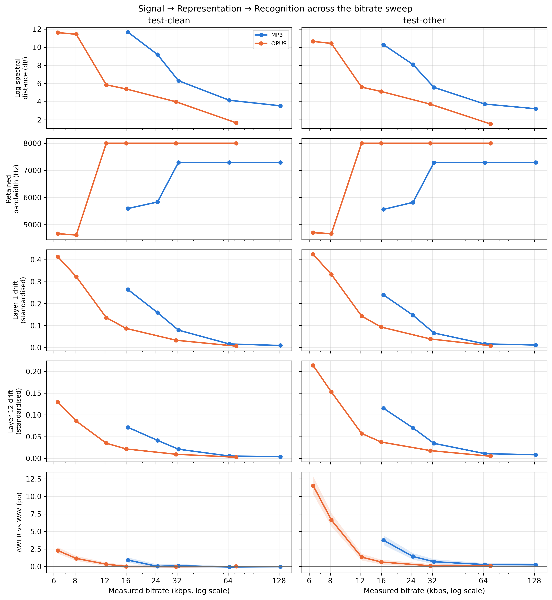
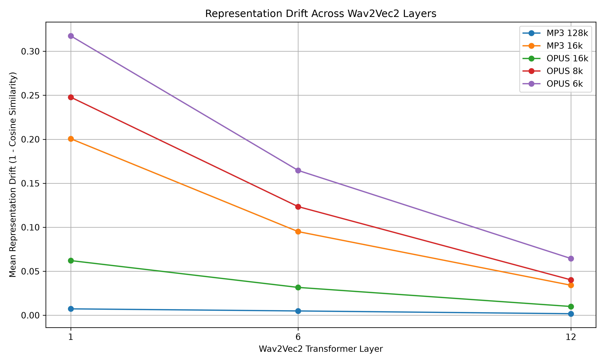
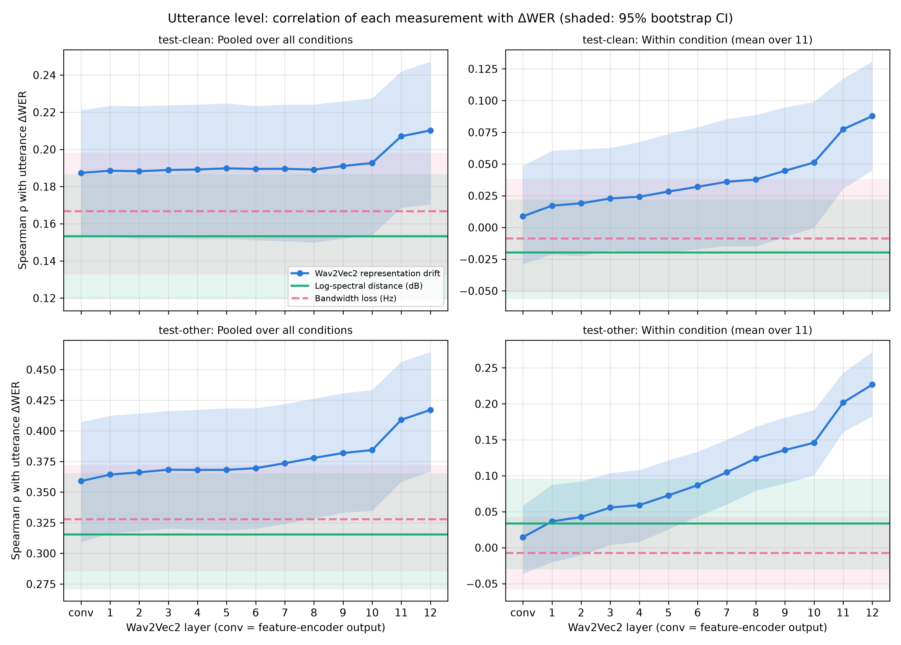
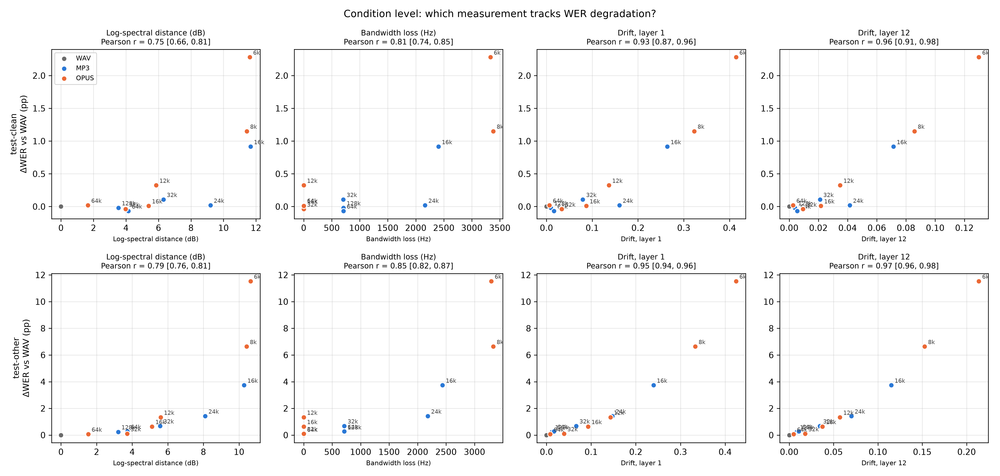
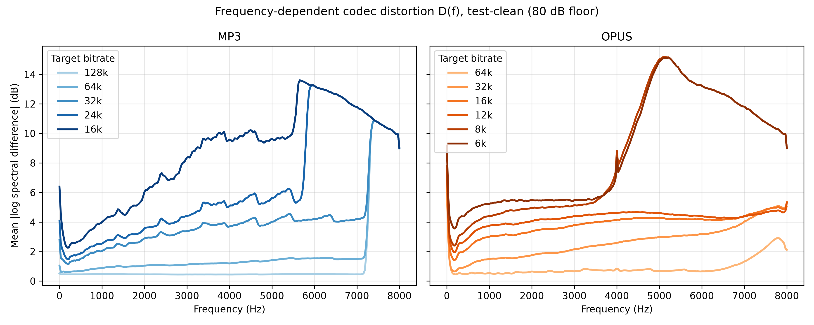
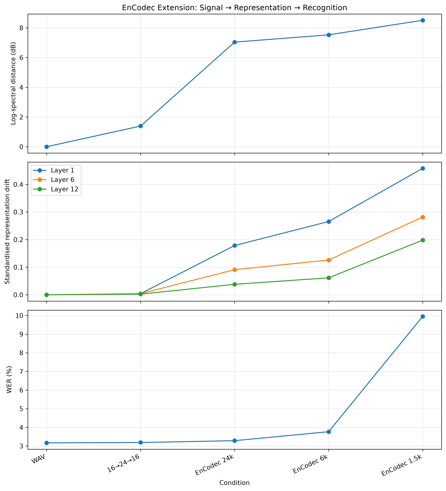

<h1>Why Is Wav2Vec2 Robust to Lossy Audio Compression?</h1>

A signal-, representation-, and task-level study of MP3 and Opus compression,
investigating why Wav2Vec2 can remain robust despite measurable codec-induced distortion.

Core experiments complete — final analysis and reporting stage

Wav2Vec2
LibriSpeech
MP3 + Opus
Signal Distortion
Representation Drift
Bootstrap CI
EnCodec Extension

<a class="button primary" href="ELEC5305%20Project%20Proposal%20v3.pdf">
View Proposal PDF
</a>

<a class="button secondary"
href="https://github.com/surnamemei/elec5305-project-540077463">
View GitHub Repository
</a>

<section class="section">

<h2>Research Question</h2>

<strong>
How do MP3 and Opus compression alter the acoustic signal and the internal
representations of Wav2Vec2, and which codec-induced distortions are associated
with the onset of ASR errors?
</strong>

  

Secondary question:

<em>
Is Wav2Vec2 robust because lossy codecs preserve the acoustic information
important to the recogniser even when measurable signal distortion is already substantial?
</em>

</section>

<section class="section">

<h2>Project Objective</h2>

Rather than treating Word Error Rate (WER) as the only outcome, this project
connects three levels of analysis:

1

<strong>Signal level</strong> spectral distortion and retained bandwidth

2

<strong>Representation level</strong> Wav2Vec2 hidden-layer drift

3

<strong>Task level</strong> WER and recognition errors

</section>

<section class="section">

<h2>Experimental Design</h2>

The main experiment uses the fixed pretrained
<code>WAV2VEC2_ASR_BASE_960H</code> model and two LibriSpeech subsets:
<code>test-clean</code> and <code>test-other</code>.

For each subset, 500 utterances are selected using the fixed random seed
<code>5305</code>. The same utterances are used across all codec conditions.

<table>

<thead>
<tr>
<th>Codec</th>
<th>Bitrates</th>
</tr>
</thead>

<tbody>
<tr>
<td>WAV</td>
<td>Uncompressed baseline</td>
</tr>

<tr>
<td>MP3</td>
<td>128, 64, 32, 24, 16 kbps</td>
</tr>

<tr>
<td>Opus</td>
<td>64, 32, 16, 12, 8, 6 kbps</td>
</tr>
</tbody>

</table>

All MP3 and Opus files are encoded using FFmpeg with
<code>libmp3lame</code> and <code>libopus</code>.
Actual effective bitrate is measured from encoded file size and duration.

</section>

<section class="section">

<h2>Main Recognition Results</h2>

3.17%

test-clean WAV baseline WER

5.45%

test-clean Opus 6 kbps WER

19.79%

test-other Opus 6 kbps WER

<table>

<thead>
<tr>
<th>Dataset</th>
<th>Condition</th>
<th>WER</th>
<th>ΔWER</th>
<th>Compression Ratio</th>
</tr>
</thead>

<tbody>

<tr>
<td>test-clean</td>
<td>WAV</td>
<td>3.17%</td>
<td>0.00 pp</td>
<td>1.00×</td>
</tr>

<tr>
<td>test-clean</td>
<td>MP3 16k</td>
<td>4.08%</td>
<td>+0.91 pp</td>
<td>15.40×</td>
</tr>

<tr>
<td>test-clean</td>
<td>Opus 8k</td>
<td>4.32%</td>
<td>+1.15 pp</td>
<td>31.41×</td>
</tr>

<tr>
<td>test-clean</td>
<td><strong>Opus 6k</strong></td>
<td><strong>5.45%</strong></td>
<td><strong>+2.28 pp</strong></td>
<td><strong>40.28×</strong></td>
</tr>

<tr>
<td>test-other</td>
<td>WAV</td>
<td>8.26%</td>
<td>0.00 pp</td>
<td>1.00×</td>
</tr>

<tr>
<td>test-other</td>
<td>MP3 16k</td>
<td>12.00%</td>
<td>+3.74 pp</td>
<td>15.33×</td>
</tr>

<tr>
<td>test-other</td>
<td>Opus 8k</td>
<td>14.89%</td>
<td>+6.63 pp</td>
<td>31.52×</td>
</tr>

<tr>
<td>test-other</td>
<td><strong>Opus 6k</strong></td>
<td><strong>19.79%</strong></td>
<td><strong>+11.53 pp</strong></td>
<td><strong>40.23×</strong></td>
</tr>

</tbody>

</table>

Selected representative conditions are shown here. Full bitrate sweeps are available
in the repository results.

</section>

<section class="section">

<h2>Three-Level Analysis</h2>

Log-spectral distance, retained bandwidth, standardised Layer 1 / Layer 12 drift and ΔWER
(shaded: 95% bootstrap CI) against measured bitrate, for all MP3 and Opus conditions and
both LibriSpeech subsets (500 paired utterances each).

<strong>Large signal distortion can leave WER unchanged</strong>
MP3 24 kbps has a log-spectral distance of 9.2 dB and removes everything above 5.8 kHz,
yet test-clean WER changes by only +0.02 pp.

<strong>Wav2Vec2 attenuates codec perturbations with depth</strong>
Standardised drift is highest at the conv output or in Layers 1–3 and falls 2.7–4.4× by Layer 12
on test-clean (1.5–2.7× on the harder test-other subset).

<strong>Bandwidth marks the transition</strong>
The largest WER jumps coincide with the codec low-pass cutoff entering the speech band:
MP3 24/16 kbps (~5.8/5.6 kHz) and Opus 8/6 kbps, where libopus switches to narrowband (~4.6 kHz).

<strong>Late-layer drift tracks failure most closely</strong>
Opus 8 and 6 kbps have the same cutoff and almost the same spectral distance, but WER
degradation doubles; Layer 12 drift (0.086 vs 0.130) separates them.

</section>

<section class="section">

<h2>Representation-Level Analysis</h2>

Mean standardised drift (1 − cosine similarity of per-dimension standardised hidden states)
at the convolutional feature output and every transformer layer, 500 utterances per subset.

Raw cosine similarity is not comparable across Wav2Vec2 layers: in Layer 11, frames of two
unrelated utterances already have a cosine similarity of about 0.94. Hidden states are therefore
standardised per dimension before comparison, after which unrelated frames are close to
orthogonal in every layer.

With this correction, codec-induced drift is largest in Layers 1–3 and decreases steadily
towards Layer 10–12. The attenuation is weaker on test-other and under the most severe
compression, where the remaining late-layer drift is accompanied by large WER increases.

</section>

<section class="section">

<h2>Which Measurement Predicts ASR Failure?</h2>

Spearman correlation of each Wav2Vec2 layer's drift with utterance-level ΔWER, compared with
log-spectral distance and bandwidth loss. Left: pooled over all conditions. Right: within a single
codec condition (which utterances fail at a fixed bitrate). Shaded: 95% bootstrap CI.

<table>

<thead>
<tr>
<th>Subset</th>
<th>Predictor</th>
<th>Condition level (Pearson)</th>
<th>Within condition (Spearman)</th>
</tr>
</thead>

<tbody>

<tr><td>test-clean</td><td>Log-spectral distance</td><td>0.75 [0.66, 0.81]</td><td>−0.02 [−0.06, +0.02]</td></tr>
<tr><td>test-clean</td><td>Bandwidth loss</td><td>0.81 [0.74, 0.85]</td><td>−0.01 [−0.05, +0.04]</td></tr>
<tr><td>test-clean</td><td><strong>Layer 12 drift</strong></td><td><strong>0.96 [0.91, 0.98]</strong></td><td><strong>0.09 [0.05, 0.13]</strong></td></tr>
<tr><td>test-other</td><td>Log-spectral distance</td><td>0.79 [0.76, 0.81]</td><td>+0.03 [−0.03, +0.10]</td></tr>
<tr><td>test-other</td><td>Bandwidth loss</td><td>0.85 [0.82, 0.87]</td><td>−0.01 [−0.06, +0.04]</td></tr>
<tr><td>test-other</td><td><strong>Layer 12 drift</strong></td><td><strong>0.97 [0.96, 0.98]</strong></td><td><strong>0.23 [0.18, 0.27]</strong></td></tr>

</tbody>

</table>

Across conditions, late-layer drift tracks the size of the WER change more linearly than any
signal-level measure (both rank the conditions similarly). Within a fixed codec condition, it is the only
measure with a (modest) association with which utterances fail. Because
Layer 12 lies directly below the CTC output layer, part of this relationship is expected; the
more informative result is that signal-level distortion, which can be measured without running
the recogniser, does not predict which utterances break.

Condition-level ΔWER against log-spectral distance, bandwidth loss and Layer 1 / Layer 12 drift.

</section>

<section class="section">

<h2>Signal-Level Analysis</h2>

Frequency-dependent distortion D(f) for every MP3 and Opus condition (test-clean, log spectra
clipped 80 dB below the reference peak).

MP3 applies a hard low-pass filter (about 7.3 kHz at 32–128 kbps, 5.8 kHz at 24 kbps and 5.6 kHz
at 16 kbps), while Opus keeps the full 8 kHz band down to 12 kbps and switches to narrowband
coding (about 4.6 kHz) at 8 and 6 kbps. The magnitude of signal distortion alone does not
predict ASR failure: Opus 8 and 6 kbps are almost identical at the signal level but differ
substantially in WER.

Methodological note: an earlier version computed log spectra as 20·log10(|X| + 10⁻⁸) without a
floor. Bins that MP3 sets to exactly zero then dominated the average, making MP3 128 kbps appear
more distorted than Opus 16 kbps. The earlier 95%-energy bandwidth measure also did not detect
codec low-pass filtering. Both were corrected; see the README for details.

</section>

<section class="section">

<h2>Statistical and Error Analysis</h2>

Paired bootstrap analysis is used to estimate confidence intervals for ΔWER.
The strongest main-experiment degradation occurs at Opus 6 kbps.

<table>

<thead>
<tr>
<th>Dataset</th>
<th>Condition</th>
<th>ΔWER</th>
<th>95% CI</th>
</tr>
</thead>

<tbody>

<tr>
<td>test-clean</td>
<td>MP3 16k</td>
<td>+0.91 pp</td>
<td>[+0.59, +1.29]</td>
</tr>

<tr>
<td>test-clean</td>
<td>Opus 6k</td>
<td>+2.28 pp</td>
<td>[+1.86, +2.76]</td>
</tr>

<tr>
<td>test-other</td>
<td>MP3 16k</td>
<td>+3.74 pp</td>
<td>[+3.07, +4.43]</td>
</tr>

<tr>
<td>test-other</td>
<td>Opus 6k</td>
<td>+11.53 pp</td>
<td>[+10.30, +12.83]</td>
</tr>

</tbody>

</table>

Recognition failures under severe compression are dominated by substitutions,
with smaller increases in deletions and insertions.

</section>

<section class="section">

<h2>Optional Neural Codec Extension</h2>

EnCodec was evaluated as a small extension to test whether the same
signal → representation → recognition pattern also appears with a neural codec.

Because the mono EnCodec model operates at 24 kHz, an uncompressed
<code>16 → 24 → 16 kHz</code> resampling control was included.

<table>

<thead>
<tr>
<th>Condition</th>
<th>WER</th>
<th>ΔWER</th>
<th>Layer 12 Drift</th>
</tr>
</thead>

<tbody>

<tr>
<td>WAV</td>
<td>3.17%</td>
<td>0.00 pp</td>
<td>0.000</td>
</tr>

<tr>
<td>Resampling control</td>
<td>3.19%</td>
<td>+0.02 pp</td>
<td>0.002</td>
</tr>

<tr>
<td>EnCodec 24k</td>
<td>3.28%</td>
<td>+0.12 pp</td>
<td>0.038</td>
</tr>

<tr>
<td>EnCodec 6k</td>
<td>3.77%</td>
<td>+0.60 pp</td>
<td>0.062</td>
</tr>

<tr>
<td><strong>EnCodec 1.5k</strong></td>
<td><strong>9.95%</strong></td>
<td><strong>+6.79 pp</strong></td>
<td><strong>0.198</strong></td>
</tr>

</tbody>

</table>

The resampling control produces negligible recognition change, while increasingly
severe EnCodec compression is associated with larger representation drift and WER.

The extension uses the same 500 test-clean utterances as the main experiment. EnCodec 24 kbps
has a larger log-spectral distance (7.0 dB) than Opus 16 kbps (5.4 dB) yet almost no WER change,
and its Layer 12 drift (0.038) is close to that of MP3 24 kbps (0.041). The drift–WER
relationship therefore carries over to a neural codec, while the spectral-distortion–WER
relationship does not.

</section>

<section class="section">

<h2>Current Interpretation</h2>

Codec-induced signal distortion can be large, up to about 9 dB log-spectral distance with a
5.8 kHz low-pass cutoff, before recognition performance changes measurably.

  

Wav2Vec2 attenuates much of this perturbation between its early and final layers. Recognition
begins to fail when the codec cutoff moves into the speech band and the perturbation that
survives to the final layers grows. Late-layer drift, not signal distortion, tracks when recognition fails most
closely; within a condition this association is modest and not causal.

This makes the project more than a codec-ranking experiment: the main contribution
is the connection between signal degradation, learned representation stability,
and downstream recognition performance.

</section>

<section class="section">

<h2>Representative Failure Cases</h2>

Individual failure analysis confirms that severe compression can transform
previously correct WAV recognition into large substitution- and deletion-heavy errors.
Representative cases are stored in:

<code>results/error_analysis/selected_failure_cases.csv</code>

and

<code>results/error_analysis/selected_failure_cases.txt</code>

</section>

<section class="section">

<h2>References</h2>

<ol class="references">

<li>
A. Baevski, Y. Zhou, A. Mohamed, and M. Auli,
“wav2vec 2.0: A Framework for Self-Supervised Learning of Speech Representations,”
2020.
</li>

<li>
W.-N. Hsu et al.,
“Robust wav2vec 2.0: Analyzing Domain Shift in Self-Supervised Pre-Training,”
2021.
</li>

<li>
J.-M. Valin, K. Vos, and T. Terriberry,
“Definition of the Opus Audio Codec,” RFC 6716, 2012.
</li>

<li>
V. Panayotov, G. Chen, D. Povey, and S. Khudanpur,
“LibriSpeech: An ASR Corpus Based on Public Domain Audio Books,”
Proc. IEEE ICASSP, 2015.
</li>

<li>
A. Défossez, J. Copet, G. Synnaeve, and Y. Adi,
“High Fidelity Neural Audio Compression,”
Transactions on Machine Learning Research, 2023.
</li>

<li>
A. Pasad, J.-C. Chou, and K. Livescu, “Layer-wise Analysis of a Self-supervised Speech Representation Model,” Proc. IEEE ASRU, 2021.
</li>

<li>
K. Brandenburg, “MP3 and AAC Explained,” AES 17th Int. Conf. on High-Quality Audio Coding, 1999.
</li>

<li>
L. Besacier, C. Bergamini, D. Vaufreydaz, and E. Castelli, “The Effect of Speech and Audio Compression on Speech Recognition Performance,” IEEE Workshop on Multimedia Signal Processing, 2001.
</li>

<li>
H.-G. Hirsch and D. Pearce, “The AURORA Experimental Framework for the Performance Evaluation of Speech Recognition Systems under Noisy Conditions,” ISCA ITRW ASR2000, 2000.
</li>

<li>
A. Radford et al., “Robust Speech Recognition via Large-Scale Weak Supervision,” Proc. ICML, 2023.
</li>

<li>
N. Zeghidour et al., “SoundStream: An End-to-End Neural Audio Codec,” IEEE/ACM Trans. Audio, Speech, and Language Processing, 2022.
</li>

<li>
H. Wu et al., “Codec-SUPERB: An In-Depth Analysis of Sound Codec Models,” Findings of ACL, 2024.
</li>

<li>
W. Timkey and M. van Schijndel, “All Bark and No Bite: Rogue Dimensions in Transformer Language Models Obscure Representational Quality,” Proc. EMNLP, 2021.
</li>

<li>
K. Ethayarajh, “How Contextual are Contextualized Word Representations?,” Proc. EMNLP-IJCNLP, 2019.
</li>

<li>
S. Kornblith, M. Norouzi, H. Lee, and G. Hinton, “Similarity of Neural Network Representations Revisited,” Proc. ICML, 2019.
</li>

<li>
R. M. Gray, A. Buzo, A. H. Gray, and Y. Matsuyama, “Distortion Measures for Speech Processing,” IEEE Trans. Acoustics, Speech, and Signal Processing, 1980.
</li>

<li>
M. Bisani and H. Ney, “Bootstrap Estimates for Confidence Intervals in ASR Performance Evaluation,” Proc. IEEE ICASSP, 2004.
</li>

</ol>

</section>

<section class="section">

<h2>Next Steps</h2>

<ul>
<li>write the final report around the predictor analysis and corrected signal / representation results</li>
<li>update the failure-case discussion using utterances with high Layer 12 drift</li>
<li>prepare the final research report</li>
<li>prepare the project demonstration video</li>
</ul>

</section>

<section class="section">

<h2>Project Repository</h2>

Full source code, experiment outputs, analysis scripts, and reproducibility notes are available at:

<a href="https://github.com/surnamemei/elec5305-project-540077463">
github.com/surnamemei/elec5305-project-540077463
</a>

</section>

ELEC5305 project — core experiments complete; final interpretation and reporting are in progress.

